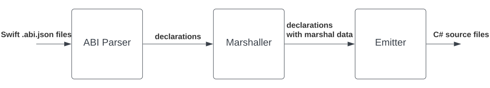

# .NET Swift interop tooling documentation

This document provides a detailed overview of the .NET Swift interop tooling, focusing on the projections between Swift and .NET, and the functional design of the tooling. The projection tooling is intended for use with C# and any other .NET language is beyond its scope.

## Usage

The tooling can consume a Swift ABI file or a framework name from the standard library. If a framework name is provided, the tool generates the ABI file based on the `.swiftinterface` file. This ABI file contains a JSON representation of the abstract syntax tree of the `.swiftinterface` file. Multiple Swift ABI files and frameworks can be specified for bindings.

```
Description:
  Swift bindings generator.

Usage:
  SwiftBindings [options]

Options:
    -a, --swiftabi, -f, --framework     Required. Path to the Swift ABI file or framework
    -o, --output                        Required. Output directory for generated bindings
    -platform                           Platform, e.g., MacOSX
    -sdk                                SDK version, e.g., 14.4
    -arch                               Architecture, e.g., arm64e
    -target                             Target, e.g., apple-macos
    -v                                  Information about work in process
    -h, --help                          Display a help message
    --version                           Show version information
    -?, -h, --help                      Show help and usage information
```

 If an unsupported syntax element is encountered in the ABI file, the tooling will ignore it and generate C# source code for known syntax elements. The generated C# bindings are published as source files to the output directory, allowing users to modify them before compilation.

## Projections

This section outlines the mappings between Swift and .NET types, and describes how the tool generates C# bindings for a Swift library. For types with similar semantics across Swift and .NET, direct interop is possible and bindings are generated. For types without direct projection, additional Swift wrappers are required and it is the user's responsibility to generate these wrappers. At this stage, the tool is designed to avoid generating any Swift code if possible to avoid complexity of maintaining different Swift compiler and SDK versions. The tool should only generate bindings for Swift types that are part of the stable ABI and don't evolve.

This section will be expanded as more support is introduced.

### Primitive types

The table below lists the Swift types and their corresponding C# types.

| Swift Type                      | C# Type  |
| ------------------------------- | -------- |
| `Swift.Int64`                   | `Int64`  |
| `Swift.UInt64`                  | `UInt64` |
| `Swift.Int32`                   | `Int32`  |
| `Swift.UInt32`                  | `UInt32` |
| `Swift.Int16`                   | `Int16`  |
| `Swift.UInt16`                  | `UInt16` |
| `Swift.Int8`                    | `SByte`  |
| `Swift.UInt8`                   | `Byte`   |
| `Int`                           | `IntPtr` |
| `UInt`                          | `UIntPtr`|
| `Bool`                          | `bool`   |
| `Float`                         | `Single` |
| `Double`                        | `Double` |

All C# types mentioned are blittable except for `bool`. To facilitate `P/Invoke`, a lightweight wrapper might be required to convert `bool` to `byte`. Swift primitive types are implemented as frozen structs that conform to Swift-specific lowering processes handled by the runtime. However, such mapping can fit within the underlying calling convention as these types are below the size limit for being passed by reference.

<details>
The Swift type database is an XML-based file format used for describing primitive data types with the following structure:

```xml
<?xml version="1.0" encoding="utf-8"?>
<swifttypedatabase version="1.0">
    <entities>
        <!-- Individual entities describing Swift data types with C# projections -->
    </entities>
</swifttypedatabase>
```
#### Elements

##### `entities`
- **Description:** Container for individual data type entities.
- **Child Elements:**
    - `entity`: Represents a specific data type in Swift.
        - **Attributes:**
        - `managedNameSpace`: Specifies the managed namespace of the data type.
        - `managedTypeName`: Specifies the managed type name of the data type.
        - **Child Elements:**
        - `typedeclaration`: Represents the declaration of the Swift type.
            - **Attributes:**
            - `kind`: Specifies the kind of type declaration.
            - `name`: Specifies the name of the Swift type.
            - `module`: Specifies the module of the Swift type.
</details>

### Pointers

Swift provides unsafe pointer types as non-owning views into memory: `UnsafePointer`, `UnsafeMutablePointer`, `UnsafeRawPointer`, and `UnsafeMutableRawPointer`. They are implemented as frozen structs in Swift and are projected as structs into C#. The runtime implements Swift structure lowering algorithm, enabling these structs to be passed correctly. They are defined with `_rawValue` property with surfaced `Pointee` property. Mutable pointers are projected as generic types to address method overload issues.

### Buffer pointers

Swift provides buffer pointer types as non-owning views into memory: `UnsafeBufferPointer`, `UnsafeMutableBufferPointer`, `UnsafeRawBufferPointer`, and `UnsafeMutableRawBufferPointer`. They are implemented as frozen structs in Swift and are projected as structs into C#. The runtime implements Swift structure lowering algorithm, enabling these structs to be passed correctly. Typed buffer pointers are defined with `_position` and `_count` properties, while raw buffer pointers are defined with `_position` and `_end`. Surfaced properties on C# side are `BaseAddress` and `Count`. Mutable buffer pointers are projected as generic types to address method overload issues.. Since these buffer pointers do not allocate or own the memory they point to, memory management is not encapsulated within the structs.

### Static and P/Invoke functions

Each provided module is projected into a separate assembly. The assembly contains a namespace named `<ModuleName>Bindings` and includes a class named `<ModuleName>`. For each public function, a `P/Invoke` signature and a corresponding method are generated. Below is an example to illustrate this process.

Swift library example:
```swift
public func sayHello() {
    print("Hello world")
}
```

User's code in C#:
```csharp
using System;
using HelloLibraryBindings;

namespace HelloWorld
{
    public class Program
    {
        public static void Main(string[] args)
        {
            HelloLibrary.sayHello();
        }
    }
}
```

Generated bindings in C#:
```csharp
using System;
using System.Runtime.InteropServices;
namespace HelloLibraryBindings
{
    public class HelloLibrary
    {
        [DllImport("libHelloLibrary.dylib", EntryPoint = "$s12HelloLibrary03sayA0yyF")]
        internal static extern void PIfunc_sayHello();
        public static void sayHello()
        {
            PIfunc_sayHello();
        }
    }
}
```

In the example, the user's code references the `HelloLibraryBindings` namespace and invokes a static method that has the same name as the Swift function. When the Swift function returns a type, the C# wrapper method also returns type, with additional processing if required. The C# wrapper method is generated only when marshalling is required. If marshalling is not needed, only a P/Invoke declaration is generated.

### Frozen structs

Frozen structs that are POD or bitwise movable are projected as C# structs with sequential layout. Fields are retrieved from the ABI file and verified in debug builds against the runtime metadata:
```csharp
[StructLayout(LayoutKind.Sequential, Size = 14)]
public unsafe struct F0_S0 {
    public Double f0;
    public UInt32 f1;
    public UInt16 f2;
    
    [UnmanagedCallConv(CallConvs = new Type[] { typeof(CallConvSwift) })]
    [DllImport("./libHelloLibrary.dylib", EntryPoint = "$s12HelloLibrary5F0_S0V2f02f12f2ACSd_s6UInt32Vs6UInt16VtcfC")]
    internal static extern F0_S0 PIfunc_init(Double f0, UInt32 f1, UInt16 f2);
    public F0_S0(Double f0, UInt32 f1, UInt16 f2)
    {
        this = PIfunc_init(f0, f1, f2);
    }
    
    [UnmanagedCallConv(CallConvs = new Type[] { typeof(CallConvSwift) })]
    [DllImport("./libHelloLibrary.dylib", EntryPoint = "$s12HelloLibrary5F0_S0V9hashValueSiyF")]
    internal static extern IntPtr PIfunc_hashValue(F0_S0 self);
    public IntPtr hashValue()
    {
        F0_S0 self = this;
        return PIfunc_hashValue(self);
    }
    
}
```

## Type database

The type database contains all information related to the mapping between Swift and C#. The type registrar is a class used for handling modules and types, where types are organized into modules. Each Swift module in the database includes the C# namespace, path to the dynamic library, a flag indicating whether it has been processed, and a hash list of types. Each Swift type includes the C# namespace, a type identifier, and pointers to runtime metadata and the value witness table.

The type database serves as a central repository that manages all type mappings. Additionally, it collects dependencies required for a module and maintains lists of unprocessed types and modules.

This is the flow when a Swift type is encountered during ABI parsing: The `GetTypeMapping` function attempts to find type mappings between Swift and C#. It begins by searching for an existing mapping in the type database using the `Registrar.GetType` method with the provided Swift module and type name. If a mapping is found, it is returned. If not found, the function then tries to find the type within the `Swift.Runtime` namespace using the `Type.GetType` method. If the type is located, it is added to the database, marked as processed, and then returned. Otherwise, the type is registered in the database as unprocessed to allow for lazy-load processing within module dependencies. When a type is encountered during the ABI parsing, it is registered as processed in the database.

## Functional outline

The tooling comprises the following components:
- **SwiftBindings**: Command-line interface that orchestrates the tooling workflow.
    - **Components:**
        - `parser`: Parses a Swift library using ABI or Swiftinterface parser.
        - `marshaller`: Marshals types between C# and Swift.
        - `emitter`: Emits a C# bindings library using string-based or object model-based emitter.
- **SwiftRuntime**: Library providing projections of common Swift types. It contains a type database for common Swift types and implements Swift runtime constructs in C#.

The general workflow for generating C# bindings from Swift code involves the following steps:
1. **Get the next ABI file or framework name:** The process begins by retrieving the next ABI path or framework name from the queue.
2. **(optional) Generate ABI file for frameworks:** If the input is a framework name, the Swift frontend compiler is utilized to generate the ABI file.
3. **Retrieve filters for ABI file:** After obtaining the ABI file, any type filters are retrieved to process the ABI file accordingly.
4. **Parse Swift ABI file:** The Swift ABI file is consumed, and the public ABI is aggregated as declarations using the ABI parser.
5. **Generate C# source code:** Using the aggregated declarations, C# source code is generated using the string-based emitter. This code generation process translates Swift declarations into equivalent C# representations.
6. **Queue unprocessed modules:** Finally, any unprocessed modules are pushed into the queue for subsequent processing cycles.



### Parser

The aggregation of the public ABI is done through the `ISwiftParser` interface. This interface defines the layout for concrete implementations responsible for parsing and collecting ABI information. Two implementations exist: Swift ABI parser and Swift interface parser. The Swift ABI parser aggregates ABI information based on an ABI json file. The Swift interface parser is designed to handle `.swiftinterface` files. The `.swiftinterface` file doesn't contain mangled names, and the parser should consume the dynamic library (`.dylib`) to generate declarations. Currently, the tooling only implements the Swift ABI parser.

### Marshaller

Ideally, marshalling logic should be done between parsing and emitting if possible. The `ModuleDecl`, `MethodDecl`, and `TypeDecl` represents model definition of collected and marshalled Swift ABI that should be projectable into C#.

### Emitter

Two different strategies are available for emitting: using an object model or a string-based approach. The object model, like Roslyn API, represents a full set of C# language. Currently, the tooling only implements the string-based emitter.
