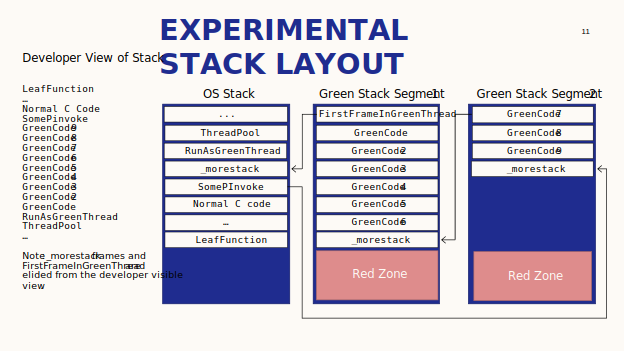
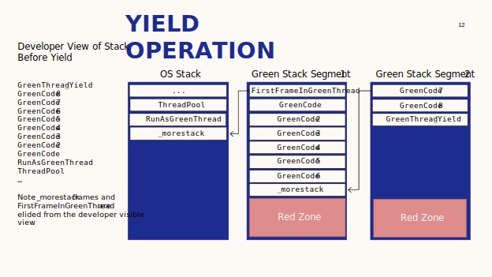
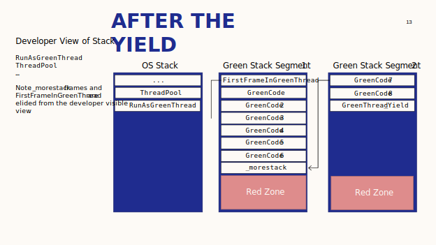
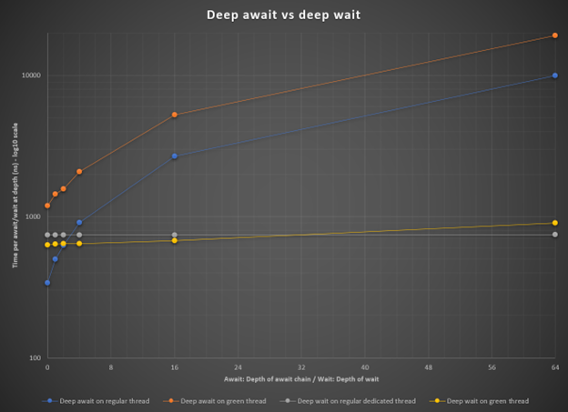

# Green Threads Technical Report

In this experiment, we sought to explore green threads on .NET to discover:
1.	Implementation constraints and details that should be considered for a production implementation.
2.	Investigate the usage of green threads in .NET, with a focus on customer and class library code that would need to adapt.
3.	Measure the performance of the product with green threads to evaluate if this is feasible from a performance standpoint.
The primary goal of the experiment was to investigate and prototype the programming model for .NET green threads. Performance information was collected with the goal of proving that we CAN implement a reasonable green threads implementation in the current .NET Runtime. Any additional findings were considered as secondary, such as performance wins or whether green threads are faster/slower than async/await, per the prototype implementation.

The report provides a detailed description of our findings. At the current time, there is no plan to move forward with the prototype, per [dotnet/runtimelab #2398](https://github.com/dotnet/runtimelab/issues/2398).

##  Implementation constraints and details
As part of the experiment, we developed an implementation of green threads in [dotnet/runtimelab:feature/green-threads](https://github.com/dotnet/runtimelab/tree/feature/green-threads) and [dotnet/aspnetcore:feature/green-threads](https://github.com/dotnet/aspnetcore/tree/feature/green-threads) repos/branches.
The general outcome is a targeted implementation based on the segmented stack model. It required a small number of new low level apis to work with green threads and to adapt a small number of higher level apis to take advantage of the new functionality and to provide expected behavior with green threads. 
### Fundamental api changes
-	`Thread.IsGreenThread` – Used to identify if the current thread is a green thread
-	`Task.RunAsGreenThread(Action)` – Similar to `Task.Run`, but runs code on a green thread, using the green thread threadpool.
-	`Task.Wait()` – When called on a green thread, will yield the green thread until the task waited on is complete, then will schedule the green thread to continue
### Higher level api changes
-	Socket and file apis were changed to support green threads by transitioning synchronous apis to async apis when called on a green thread.
-	Kestrel in ASP.NET was modified to support writing a response via a green thread.

### Implementation constraints discovered during research
A general principle of the green thread effort was that normal, already existing .NET code should be able to work when run on a green thread. There are a number of specific features of .NET which complicate implementation of green threads, and this document will attempt to describe the .NET features which are known to be problematic, and why.
1. Support for byref parameters
  - Known to be problematic, as they cannot simply be copied to the GC heap, and can currently only be reported to the GC as part of the stack walking logic.
2. Support for conversion of byrefs to pointers
  - Certain byrefs, if they are known to point to the stack can safely be converted into pointers.
  - As pointers are not trackable by the runtime (and this is not fixable, as it is legal to export pointers to a non-process visible location, and then bring them back), it is not possible to safely implement a scheme which allows stacks to be moved during GC in all circumstances.
  - This complicates the design of a green thread system, as it cannot use a contiguous stack for green threads, as it would need to be prohibitively large.
  - Other systems that have successfully transitioned to green threads such as Go/Java do not have this capability, and are able to implement green thread approach which do not have the Hot-Split problem.
3. Support for function pointers
  - Given the presence of function pointers, it is more difficult to implement a scheme where code that executes on a green thread is distinct from code which executes on normal threads.
  - This will make it more difficult to specialize jitted code for green threads.
4. P/Invoke
  - P/Invoked code must execute on the normal OS stack as it is not specialized to work with green threads.
  - In addition, P/Invoke is an opportunity for extremely problematic faults. In particular, if a p/invoke exposes OS thread specific state to the green thread, it may not behave correctly, as future calls to native code on the same green thread may not occur on the same OS thread.
5. OS Security features
  - In particular, shadow stack features, such as [Intel CET](https://github.com/dotnet/designs/blob/main/accepted/2021/runtime-security-mitigations.md#intel-control-flow-enforcement-technology-cet) are not simple to make compatible with green threads.
  - The current Windows implementation of CET is not capable of working with green threads; however, it may be possible to change the Windows Kernel/API surface to make it compatible.
6. OS injection of code to the thread
  - Under some circumstances, Windows will run code on the thread stack. Notably, user APCs and hardware exceptions will trigger running arbitrary code on the thread stack. As this code was not built for running on a condensed stack, there are potential problems here.
7. The existing Async/Await pattern
  - The existing async/await pattern is both ubiquitous throughout the libraries and not entirely compatible with the green threading model. While it isn’t technically an implementation problem, it provides significant opportunity for customer confusion.
  - We chose to integrate the api for these two constructs which ended up working out.
8. Support for thread static variables
  - Thread statics are commonly used within the BCL to achieve great performance. However, the green thread model in many languages assumes that each green thread has a unique set of thread statics.
  - In .NET we have more usage of these variables, so we implemented a re-use model for thread statics. This mirrors how our ThreadPool gets the best performance.

### Implementation Challenges
During the implementation, we encountered numerous challenges.
- The Windows OS is not designed to allow green threads. Making this work relies on somewhat undocumented behavior
- Various diagnostic tools fail to work reliably (ETW, windbg, TTD)
- SEH exception handling does not safely handle cross stack segments
- Diagnosing implementation issues has been very slow and difficult, as they tend to cause memory corruption across multiple threads
- Every OS/Architecture pair needs quite a bit of custom hand-written assembly. It is possible that MUSL-based Linux may need different logic than glibc-based Linux.
-	The prototype implementation was built on Windows due to team member familiarity with the platform, and therefore implementation challenges discovered were focused on the problems encountered in development on Windows. However, there are non-Windows issues that were discovered
  - Thread local storage access on Unix platforms may utilize an unbounded amount of stack as it requires a call to a libc provided function in some cases.
  - Integration of Linux Perf with split stack is not supported as far as research has shown.

### Design of underlying runtime changes
The underlying runtime was changed to support allocating stack segments and transitioning onto those segments when running on the thread pool. The implementation chosen was a fairly simple segmented stack approach, which is known to have various hot-split problems, but is generally considered the most straightforward way to implement a custom thread stack system.
In the implementation, we chose to implement a unified stack with both local variables and the control stack together. This was chosen as it is somewhat simple to implement and did not violate any of the implementation constraints found. In order to support injected OS code onto the stack, as well as FCalls/HCalls, a Red Zone of about 4KB was added to each stack segment, bringing the minimum stack allocation to 12KB for a stack segment.
Yield and resume are implemented via patching return addresses of certain well known stack frames.
All green threads were run on the thread pool, and allocation of green threads themselves was done from a pool of green threads.

#### Stack Transitions
As the implementation utilizes stack segments which cannot be used to run significant amounts of native code, there are various explicit transition points between stacks.
1.	When entering a green thread
  -	When entering a green thread, the stack pointer will be updated to the green thread, and a well known frame placed on top of the stack to facilitate stack patching.
2.	When calling native code
  -	When calling native code, either through a p/invoke, FCall, or HCall, the logic will transition back to the OS thread to allow arbitrary C++ code to execute.
3.	When the needed stack space exceeds the amount on the current stack segment.
  -	The segmented stack model for green threads allows for arbitrarily deep callstacks. This is done by forming a linked list of stack segments
  -	The presence of this linked list creates the Hot Split problem. The Hot Split problem is when an application has a need to grow to a new stack segment on each iteration of a hot loop. This can cause extremely significant unexpected performance degradation. This experiment does not attempt to work around the problem.

#### Pre-prolog
To support growing the stack, a pre-prolog was added to each managed function. While the prototype adds this to all functions, in a more production implementation, the pre-prolog would only be needed for non-leaf functions which do not use more the X bytes of stack space. (X chose empirically to provide best performance). The X bytes would be allowed to allocate within the red zone of the stack segment.
The following is an example of a pre-prolog.
```
lea    rax, [rsp - 4352]   // Compute address of Stack pointer – (neededstack + red zone size)
cmp rax, qword ptr gs:[16] // Compare against end of stack pointer in TEB
ja NormalProlog            // Jump to RestOfFunction
mov     eax, 0x34000008    // Argument to _morestack function describing incoming argument
                           // size and stack space needed for function
call   _morestack          // Call to _morestack function to jump to new stack
NormalProlog :             // Label indicating the start of the normal prolog of the method
```

#### P/Invoke transitions
As normal C code cannot safely run in a green stack segment, all p/invokes must transition to a normal thread. This transition adds significant code to each p/invoke transition. For example, consider the following 2 segments of assembly. The first is without green thread transition support, and second is with.

##### P/Invoke transition without green thread support
```
lea     rcx, [rbp - 144]                                   ; Perform GC transition to GC Preemptive
call    qword ptr [0xba67e8]  // PINVOKE_BEGIN (HELPER) 
mov     rax, qword ptr [0xbc6650] (INDIRECT_PINVOKE_TARGET); Load address of native function
mov     rax, qword ptr [rax]
mov     rdx, rsi
xor     ecx, ecx
mov     r9d, 2
call    rax                                    ; Call the native function, or thunk to OS thread function
mov     esi, eax                               ; Handle return value
lea     rcx, [rbp - 144]                       ; Perform GC transition back to GC Cooperative
call    qword ptr [0xba67f0]  // PINVOKE_END (HELPER)
```

##### P/Invoke transition with green thread support
```
lea     rcx, [rbp - 144]                                   ; Perform GC transition to GC Preemptive
call    qword ptr [0xba67e8]  // PINVOKE_BEGIN (HELPER) 
mov     rcx, qword ptr [0xbc6650] (INDIRECT_PINVOKE_TARGET); Load address of native function
mov     rcx, qword ptr [rcx]
mov     edx, 32                                       ; Size of stack arguments needed by target function
; Call helper function which if on a green thread will
; setup for a green thread transition, and replace
; the function pointer with a transition thunk
call    qword ptr [0xba68d0]  // COMPUTE_GREEN_THREAD_TRANSITION 
mov     r8d, edi                                        ; Load register arguments for calling native function
mov     rdx, rsi
xor     ecx, ecx
mov     r9d, 2
call    rax                                     ; Call the native function, or thunk to OS thread function
mov     esi, eax                                ; Handle return value
lea     rcx, [rbp - 144]                        ; Perform GC transition back to GC Cooperative
call    qword ptr [0xba67f0]                    ; PINVOKE_END (HELPER)
```

#### Stack layout diagrams

Diagram of what the stack may look like when using multiple stack segments and a p/invoke:


 

Diagram of before yield:



Diagram of after yield:


 

## Impact on the programming model
The green threads prototype has several implications on public API surface area.

The following APIs were added:

- `Thread.IsGreenThread` -- A property to check whether you’re currently running on a green thread.
- `Task.RunOnGreenThread` -- A method that queues work to run on a green thread and gives you back a Task to represent that work.  

All other details are handled by the implementation. A critical detail then is how do synchronous APIs participate in being handled asynchronously under the covers.  Any synchronous API that wants to be implemented in terms of a counterpart asynchronous API requires a small amount of stub code to be included.  

For example, the synchronous:

```
public int Receive(byte[] buffer, int offset, int size, SocketFlags socketFlags)
```
method gets this bit of boilerplate added to the beginning of its implementation:
```csharp
if (Thread.IsGreenThread)
{
    ValueTask<int> vt = ReceiveAsync(buffer.AsMemory(offset, size), socketFlags);
    return vt.IsCompleted ?
        vt.GetAwaiter().GetResult() :
        vt.AsTask().GetAwaiter().GetResult();
}
```
In other words, the synchronous Receive checks whether it’s on a green thread, and if it is, instead delegates to the corresponding ReceiveAsync method.  That method returns a ValueTask<int>.  If that operation completes synchronously, or at least has completed by the time we check, then this “synchronous” operation just returns the result of the completed operation (or throws an exception if it failed).  If, however, the operation didn’t complete yet, the implementation blocks in the equivalent of Task.Wait().  The implementation of Task.Wait has been updated with the necessary logic to suspend this green thread until the Task completes, hooking up a continuation to the Task that will resume the green thread when the Task completes, unblocking the wait.
This approach makes it fairly straightforward for us to instrument any synchronous API with an asynchronous counterpart, having the former delegate to the latter, albeit with a variety of implications:
-	There is now overhead involved in the synchronous operations that we didn’t exert before and that doesn’t exist in the corresponding asynchronous method. This includes needing to check the current thread to determine whether it is a green thread, and also to pay for a Task to be created and a synchronization primitive (e.g. manual reset event) to be created as part of the wait.  Some of this is inherent to the operation, and some of it could likely be optimized in the future should it be necessary.  There are other costs that will be larger and more challenging.  For example, the previous Receive example accepted a byte[] into which to store the received data. What about the overload that takes a Span<byte> instead?  Delegating to the asynchronous implementation requires something that can be stored on the heap.  The prototype currently implements this by renting an array pool array, receiving into that, and then copying back into the span, but that has measurable overhead, in particular for synchronous operations that complete synchronously due to data already being available.  There are other possibilities to explore, such as pinning and utilizing a pooled heap-based object that can be passed around, or pinning and using some other non-Memory<byte>-based asynchronous implementation implemented to work directly in terms of a pointer/length.  Employing such options, however, will increase the complexity and scope of the work required to roll this out broadly.
-	Any synchronous implementations that want to scale via being made asynchronous need to either be implemented in terms of other APIs that are themselves optimized for green threads, or it needs to have an asynchronous counterpart it can be implemented in terms of.  The majority of our synchronous I/O APIs do have such counterparts, but not all do.  We’d need to add them everywhere it was deemed important.
The inverse is also relevant to consider.  While the majority of our functionality is exposed as at least a synchronous method and then potentially also an asynchronous method, there are a few libraries where only asynchronous APIs have been exposed for the relevant functionality, e.g. System.Threading.Channels, System.IO.Pipelines, and to a large extent, System.Net.Http (although it gained a minimal set of golden-path synchronous APIs in a few years back).  We would need to consider whether to add synchronous APIs to these libraries.  If we didn’t add them, developers that wanted to consume them in a scalable manner from green threads would need to wrap them themselves; we could potentially provide helpers to make that boilerplate easier.  If we did add them, we’d need to think through the ramifications for when they’re used _not_ on green threads.  This kind of sync-over-async API is something we actively discourage developers from adding today, and choose to never do ourselves in new surface area.
### Ways in which green threads are a leaky abstraction
There are a number of details about the green thread design with are “leaky” abstractions
-	If a green thread calls into native code and then back into managed, we cannot yield the thread, and any attempts will simply fall back to a standard thread blocking wait
-	Interaction with native code which has thread static state is risky. If a bit of interop exposes native thread state to managed code, and then the thread changes out underneath that code interesting behaviors may occur

### Example of change to plaintext demo app

Before
```csharp
var response = context.Response;
response.StatusCode = 200;
response.ContentType = "text/plain";
response.ContentLength = payload.Length;
return response.Body.WriteAsync(payload).AsTask();
```
After
```csharp
var response = context.Response;
response.StatusCode = 200;
response.ContentType = "text/plain";
response.ContentLength = payload.Length;
// This is async IO under the covers!
response.Body.Write(payload);
```

## Measured results
A number of results were gathered to validate the performance characteristics of the system. Mostly they indicated that there were some quality of implementation issues, but that implementation of green threads was a feasible approach.
### Socket Microbenchmarks
The microbenchmarks measure some overheads and some simple in-proc socket operations for comparison.

Yielding a green thread and resuming it combined takes about 500 ns. By comparison, two context switches of a regular thread take about 8 µs. This may be interesting for reducing the CPU overhead of spin-waiting, and custom thread scheduling. Awaiting an async operation and continuing it takes only 110 ns, so there is a bit of a gap. However, async/await can become viral and longer await chains would each incur the overhead whereas green thread yield/resume would not.



- [Deep await on regular thread VS Deep await on green thread] Awaits have more overhead currently when they happen on green threads. Since the continuation need to be marshaled to run on a green thread, they miss the fast path, involving more allocation, and some more overhead in switching to a green thread. There may be ways to reduce this overhead, but there will probably be some overhead that is a necessary consequence of enabling both green and non-green threads to interoperate. For instance, if thread pool worker threads ran as green threads by default, some of this overhead would likely go away.
- [Deep wait on regular dedicated thread VS Deep wait on green thread] Both appear to be similar, with slightly worse scaling on green threads. At lower depths perf is better on green threads, a theory may be that the yield/resume latency is better than spin-waiting latency. At higher depths, the extra cost may be a result of stack switching and less efficient use of memory.
- [Deep await on regular thread VS Deep wait on green thread] It seems clear that longer await chains don’t scale well. They don’t happen in TechEmpower benchmarks, I have seen very long await chains in Bing SNR. Await on a regular thread is cheaper at low depths, this is a similar gap to what was mentioned before, perhaps there would be ways to reduce it but likely some of this gap will remain and yield tradeoffs.

Some other numbers from microbenchmarks:
- Reusing green threads
  - Creating a green thread currently takes about 3 µs. Reusing a green thread takes about 600 ns.
  - Creating a green thread and using a very deep stack currently takes about 120 µs. Reusing a green thread and using a very deep stack takes about 24 µs.
  - While these are unrealistic tests, there seems to be an indication that reusing green threads would be beneficial. Alternatives may be to create a more efficient way to reuse green thread stacks, and/or to better predict the initial stack size.
- Socket benchmark with one in-proc client/server
  - The best perf seems to be attained by the least practical approach, dedicating a regular thread to each (it doesn’t scale), yielding about 57 µs per request/response
  - Async/await on a regular thread takes 64 µs
  - By comparison, utilizing a green thread and synchronous waits takes 67 µs. Ideally we’d want this number to beat async/await, and be closer to the perf using dedicated threads.

### ASP.NET Benchmarks
The ASP.NET benchmark is effectively a worst case scenario for green threads, as it performs effectively no useful computation, and has only a single async operation, which will always wait. However, performance is still quite reasonable.


## Unexplored Details
This project only scratched the surface of details to measure, and prototypes to build. Looking at the industry, competitive runtimes which use green threads, have spent years tuning their systems, and finding new ways to make their products better. Here is a list of possible additional areas to explore, should we wish to know more on this subject.
-	User research – Validate our hypotheses about the green threads programming model with customers
- Build a prototype that works on Linux
-	Broader benchmarks of more real-world code
-	Investigate impact of green threads infrastructure on non-green thread code
-	Enable support for exceptions, and validate that the performance of exceptions on green threads is substantially better than performance on exceptions over async/await
-	Work with Windows kernel team to develop a model that would allow .NET to manage its own thread stacks without abandoning the security posture that Windows provides
-	Enable non-conservative stack scanning of green thread stack segments, and measure performance
-	Evaluate scalability of green thread system, and evaluate reasonable performant limits
-	Investigate where to put IsGreenThread checks. Should they be scattered through code, or only in I/O?
-	Investigate the performance impact of the “Hot Split” stack segment problem, and brainstorm possible solutions
-	Fix ETW in Windows to allow it to work with the green threads
-	Fix stability problems in implementation, to allow for greater ease and reliability of experimentation
-	Evaluate P90, P95, an P99 latency numbers. At this time, the system is insufficiently stable to do this work
-	Explore other approaches for stack handling

## Conclusion
- Green Threads are possible in .NET and the programming model is straightforward for simple scenarios; however, its another layer of complexity for the developer.
- Using Async code in the current green thread prototype shows significant performance challenges
-	The impact on normal code execution performance is not yet clear 
- Green threads will require significant effort to integrate with various security features
